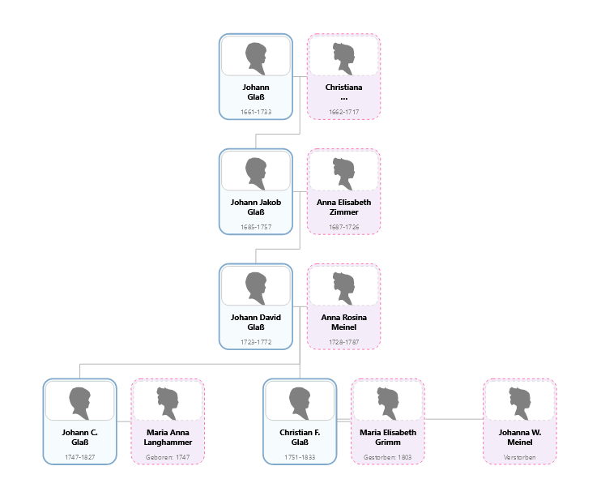

<!-- TOC -->
* [Descendants chart](#descendants-chart)
  * [Installation](#installation)
    * [Manual installation](#manual-installation)
      * [Configuration](#configuration)
      * [Usage](#usage)
    * [Using Composer](#using-composer)
    * [Using Git](#using-git)
  * [Development](#development)
    * [Run tests](#run-tests)
<!-- TOC -->


# Descendants chart
This module provides an SVG descendant chart for the [webtrees](https://www.webtrees.net) genealogical application.
It is capable of displaying up to 25 generations of descendants from an individual.

**But beware, if you select too many generations, it may take a while and even slow down your system significantly.**

In addition to the descendants, the respective spouses are also displayed for a person. The display can be 
deactivated via the configuration form so that only the direct descendants are displayed.



*Fig. 1: A four generations descendants chart with spouses (drawn top to bottom)*


## Installation
Requires webtrees 2.2.

There are several ways to install the module. The method using [composer](#using-composer) is suitable 
for experienced users, as a developer you can also use [git](#using-git) to get a copy of the repository. For all other users, 
however, manual installation is recommended.

### Manual installation
To manually install the module, perform the following steps:

1. Download the [latest release](https://github.com/magicsunday/webtrees-descendants-chart/releases/latest) of the module.
2. Upload the downloaded file to your web server.
3. Unzip the package into your ``modules_v4`` directory.
4. Rename the folder to ``webtrees-descendants-chart``

If everything was successful, you should see a subdirectory ``webtrees-descendants-chart`` with the unpacked content 
in the ``modules_v4`` directory.

Now the module has to be activated within Webtrees.

#### Configuration
Go to the control panel (admin section) of your installation and scroll down to the ``Modules`` section. Click
on ``Charts`` (in subsection Genealogy). Enable the ``Descendants chart`` custom module (optionally disable the original
installed descendant chart module) and save your settings.


*Fig. 2: Control panel - Module administration*

#### Usage
At the charts' menu, you will find a new link called `Descendants chart`. Use the provided configuration options
to adjust the layout of the charts according to your needs.

Furthermore, it is possible to export the generated tree diagram as an SVG or PNG image
in order to be able to use it elsewhere.


### Using Composer
Typically, to install with [composer](https://getcomposer.org/), just run the following command from the command line,
from the root of your Webtrees installation.

``` 
composer require magicsunday/webtrees-descendants-chart --update-no-dev
```

The module will automatically install into the ``modules_v4`` directory of your webtrees installation. 
To make this possible, the "magicsunday/webtrees-module-base" package is used. Approval within Composer
may be required here to authorize the execution of the package.

To remove the module run:
```
composer remove magicsunday/webtrees-descendants-chart --update-no-dev
```

Then follow the steps described in [configuration](#configuration) and [usage](#usage).

#### Latest version
If you are using the development version of Webtrees (main branch), you may also need to install the development
version of the module. For this, please use the following command:
```
composer require magicsunday/webtrees-descendants-chart:dev-main --update-no-dev
```


### Using Git
If you are using ``git``, you could also clone the current main branch directly into your ``modules_v4`` directory 
by calling:

```
git clone https://github.com/magicsunday/webtrees-descendants-chart.git modules_v4/webtrees-descendants-chart
```

Then follow the steps described in [configuration](#configuration) and [usage](#usage).


## Development
To build/update the javascript, run the following commands:

```
nvm install node
npm install
npm run prepare
```

### Run tests
```
composer update
vendor/bin/phpstan analyse --memory-limit=-1 -c phpstan.neon
vendor/bin/phpcs src/ --standard=PSR12
```
